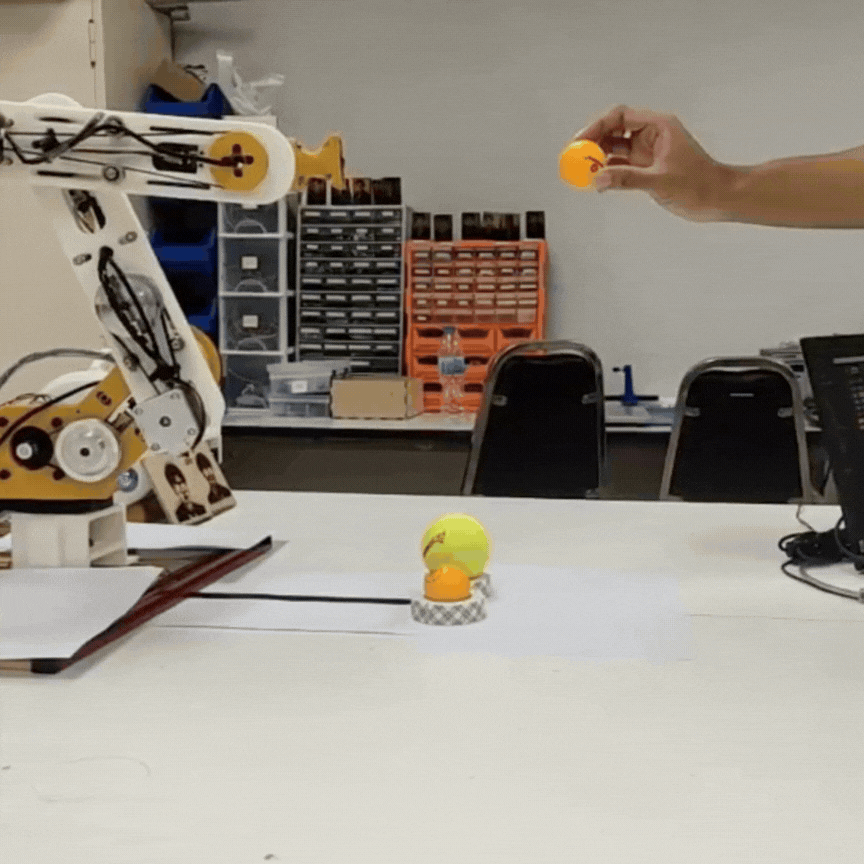
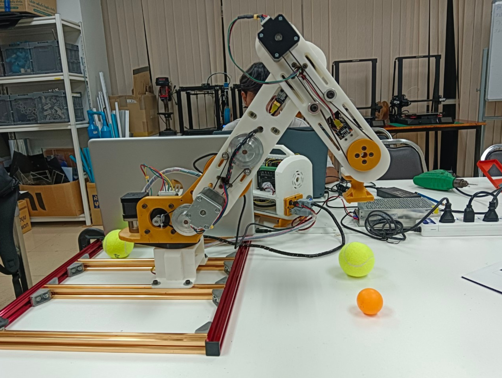
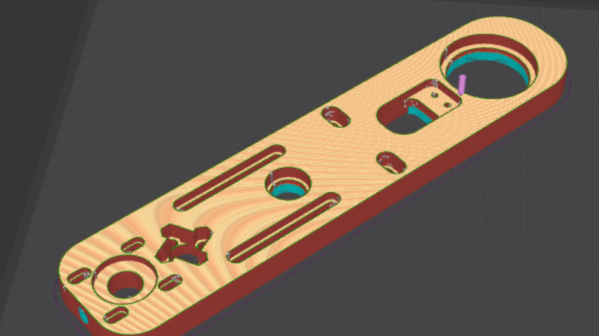
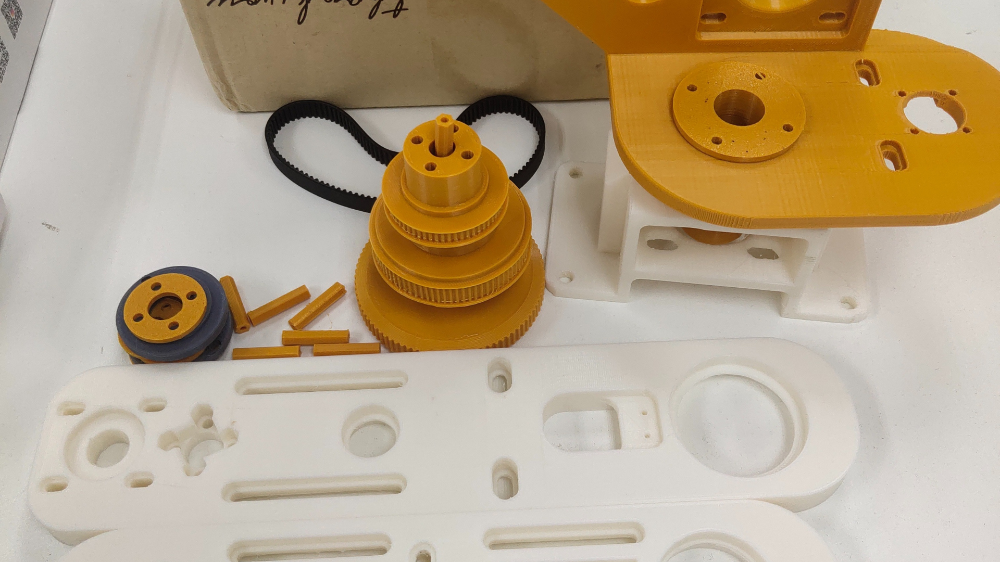
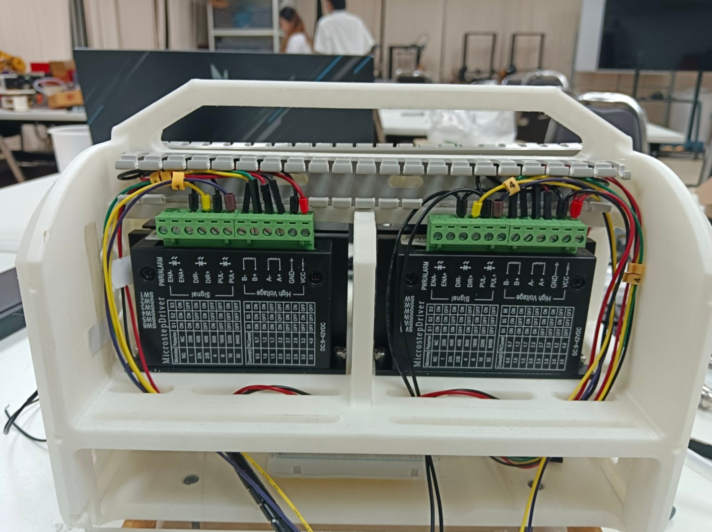
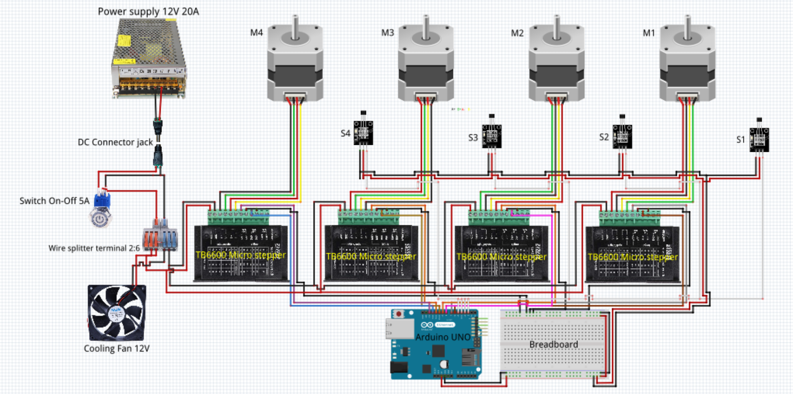

# Vision-Guided 3D-Printed Robotic Arm (R4)

A comprehensive mechatronics project that integrates mechanical design, kinematic calculations, and an AI-driven machine vision system. The **R4 Robotic Arm** was fully 3D-printed and programmed to autonomously track marker lines and interact with specific target objects (Tennis and Ping-Pong balls) using real-time object detection.

> **Project Note:** This is a legacy academic project. The original Python source code has been lost over time. Therefore, this repository serves as a **Hardware & System Architecture Portfolio**, showcasing the CAD models, kinematic mathematics, structural assembly, and system logic.

## Project Overview

The objective of this project was to design a robotic arm capable of identifying and differentiating between a Ping-Pong ball (40mm) and a Tennis ball (64mm), and interacting with them. The system bridges the gap between high-level image processing (Computer Vision) and low-level motor control.

## Mechanical Design & 3D Printing
The entire structure of the R4 Robotic Arm was custom-designed using **SolidWorks** and manufactured using FDM 3D printing (Creality). 
* **Design to Reality:** Below is the comparison between the CAD model rendering and the actual 3D-printed assembly.

  
  

## Electrical & Wiring Architecture
The control system relies on an **Arduino UNO** interfacing with **TB6600 Microstepper Motor Drivers** to deliver precise joint movements. 
* To ensure electrical safety and effective heat dissipation, a custom 3D-printed enclosure was designed specifically to house the microsteppers, cooling fans, and the 12V 20A Power Supply.

## Machine Vision & AI Integration
The vision system was developed using **Python** and **OpenCV** to detect target objects and a black marker line (20x1.5 cm) for navigation.
* **Roboflow Integration:** Used for advanced object classification to confidently differentiate between the spherical shapes of Ping-Pong and Tennis balls.

## Kinematics & Homing Sequence
Mathematical modeling was applied to ensure the end-effector (camera/gripper) reaches exact X, Y, Z coordinates. The system relies on rigid **Forward and Inverse Kinematics** calculations.
* **Homing & Calibration:** Below is the initialization sequence where the arm calibrates its joints to the designated Home and Start positions.

## Known Limitations & Bottleneck Analysis
During system integration, the following engineering challenges were identified:
1. **Processing Bottleneck (FPS Drop):** Running the Roboflow object detection model simultaneously with OpenCV caused the camera's frame rate to drop to **5-10 FPS**. 
2. **Movement Latency:** Because the Python script executed synchronously, the robotic arm had to "wait" for the heavy image processing cycle to finish before sending the next Serial command to the Arduino. This resulted in delayed and sluggish physical movements.
3. **Shape Similarity:** Occasional misclassification occurred due to the identical spherical nature of both target balls, highly dependent on ambient lighting and background contrast.

## Repository Structure & Resources
* **`/Calculations`**: Contains the PDF report detailing mathematical proofs, Forward/Inverse Kinematics, and motor torque calculations.
* **`/Media`**: Demonstration GIFs and system architecture images.
* **CAD & 3D Models (SolidWorks)**: 🔗 **[Download from Google Drive](https://drive.google.com/drive/folders/1M2cmV3samh9nUpj8-SmQx6YoAdvOQSRs?usp=sharing)** *(Note: Hosted externally due to large assembly file sizes)*
* **Full Demonstration Video**: 🔗 **[Watch on YouTube](https://youtu.be/AqJGE4pfKxM)**